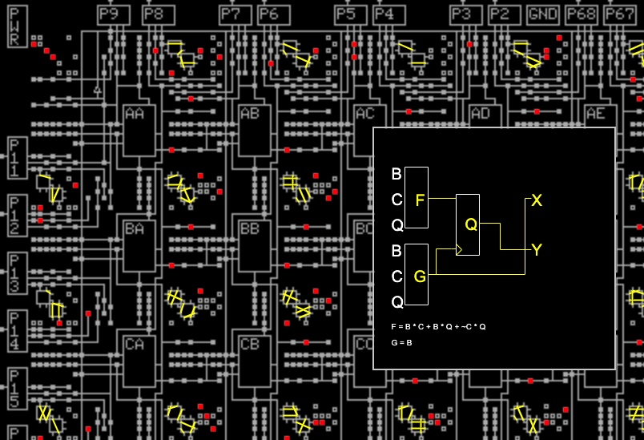

## xc2064
This is an in-progress project to document the internals of the XC2064 FPGA.
The XC2064 was the first FPGA, introduced by Xilinx in 1985. This FPGA contained just 64 complex logic blocks
(CLBs), in an 8x8 grid. It was soon followed by the XC2018, which was essentially the same chip but with 100 CLBs in a 10x10 grid.

### The code

* The files in html implement a tool to decode a raw bitstream file (RBT).
* Try it (_under development_) at [righto.com/xc2064](https://righto.com/xc2064/)

Main missing features
* Need to link connections into nets
* Need to output LCA and/or Verilog
* Pads support is only partially implemented
* This is a prototype work in progress and lots of things don't work right

Sample output:

### Links

* My blog post [Reverse-engineering the first FPGA chip, the XC2064](https://www.righto.com/2020/09/reverse-engineering-first-fpga-chip.html).
* Die photos of the [XC2064](http://siliconpr0n.org/map/xilinx/xc2064/) and [XC2018](http://siliconpr0n.org/map/xilinx/xc2018/).
* [XC2000 family datasheet](https://media.digikey.com/pdf/Data%20Sheets/Xilinx%20PDFs/XC2000%20Families.pdf)
* [XACT development system manual](https://www.xilinx.com/txpatches/pub/documentation/xactstep6/dsuser.pdf)
* [John McMaster's XC2064 project](https://github.com/JohnDMcMaster/project2064)

Thanks to Geoff Body for XC2064-def.txt
